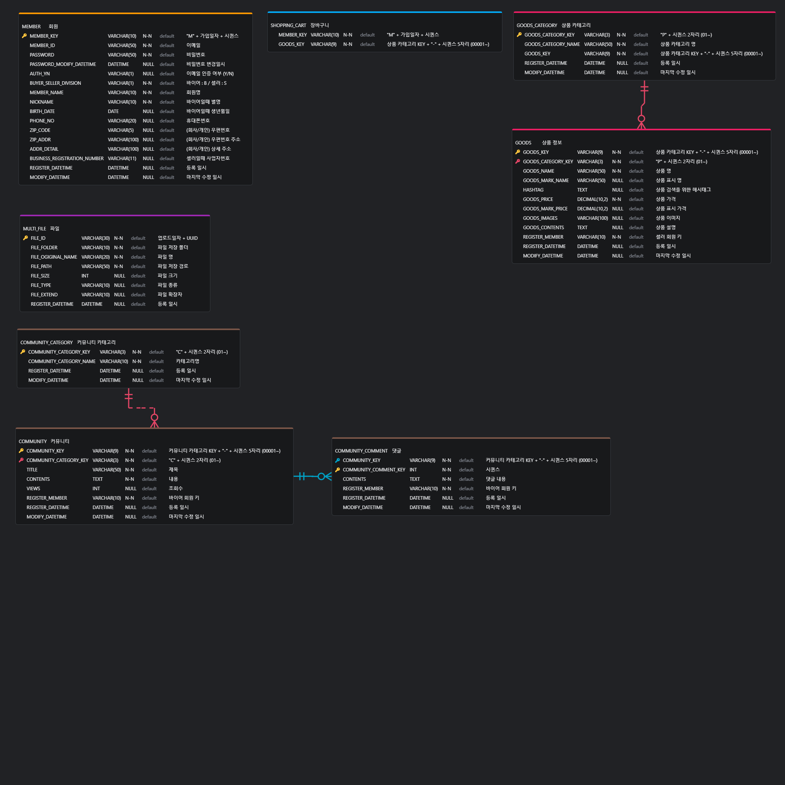

# 🌞 SUN SHOPPING MALL (BACKEND)

## ✍ 프로젝트 개요
Spring Boot 기반의 RESTful 쇼핑몰 백엔드 API.

## ✍ 기능 목록
#### 🙍‍♀️ 회원
- 회원가입
- 로그인
- 내정보수정
#### 🎁 상품
- 상품 등록 / 조회 / 수정 / 삭제
#### 🛒 장바구니
- 장바구니 등록 / 삭제
#### 💋 커뮤니티
- 게시글 등록 / 조회 / 수정 / 삭제
- 댓글 등록 / 조회 / 수정 / 삭제

## ✍ 사용 기술 스택
- MySQL 8.0 : 관계형 데이터베이스
- java 17 : LTS 버전
- SpringBoot : 자동 구성과 내장 서버 기능을 갖춘 프레임워크
- gradle : 빌드 자동화 도구
- swagger : API 문서 자동화
- Intellij/VS Code : 개발환경
- Docker : 로컬에서 DB 컨테이너 사용
- Git/GitHub : 버전관리

## ✍ DB 구조
